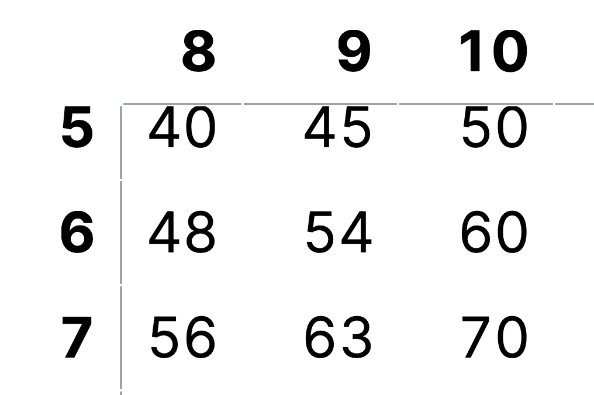
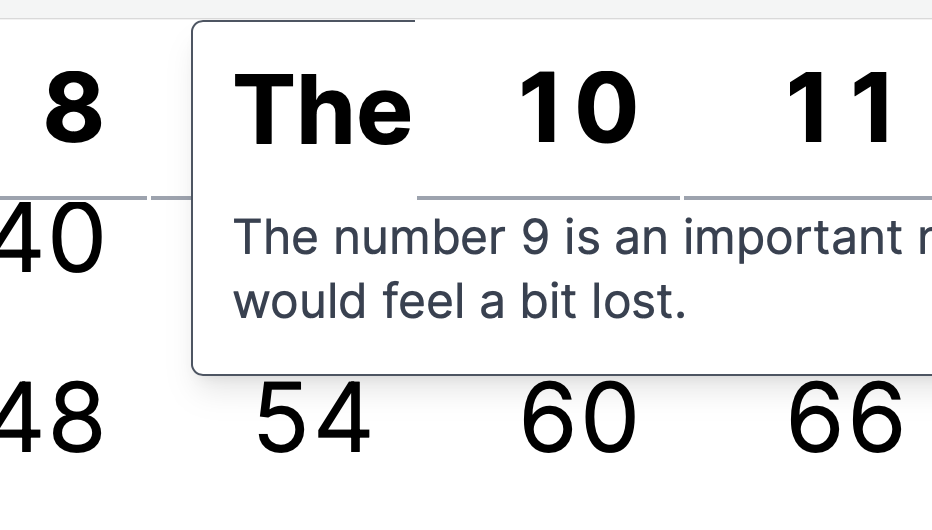
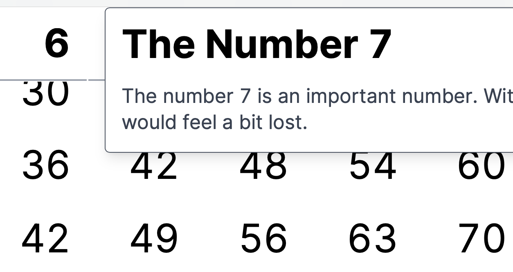

# Sticky Table Headers and Popovers with Next.js and Tailwind CSS

I recently came across a problem that I wanted to make a potentially 
large table where the headers are sticky. Thus, when you scroll through
the table (vertically and horizontally) you still see in which column
and row you are in. The behavior is similar to the freezing of the
header rows and columns in Excel.




You can achieve this effect by slapping something like the 
following to your header cells (using [Tailwind CSS](https://tailwindcss.com))

```
<th className="sticky top-0 left-0 bg-white">...</th>
```

Leave away the `top-0` if the cell is at the beginning of a row 
(and use `td` instead of `th`)
or leave away the `left-0` if the cell is in the header row.

## Adding a headlessui Popover

However, as the table is quite dense and I didn't have much room in those
header cell to add some more explanation, I wanted to add a Popover
(using the [headlessui/react](https://headlessui.com/react/popover) library).
I soon stumbled on the problem that the popover was hidden by the next `sticky`
header cell further down the DOM.




The way the Popver works is that the popover is like a `relative` group with
an `absolute` popover that is hidden unless the cursor is hovering over the group.
The rough structure is
```
<th className='sticky top-0'>
  <Popover className='relative group'>
    <Popover.Button>
      {number}
    </Popover.Button>
    <Popover.Panel static className="z-10 hidden group-hover:block absolute">
      {/* content here... */}
    </Popover.Panel>
  </Popover>
</th>
```

Even increasing the z-index on the popover panel (`z-10`) didn't yield the 
desired effect.
By now, I think the reason is that the z-index of the whole is determined by the
sticky node and trying to change it on nodes below 
has no effect on "neighbouring" `sticky` nodes.

## Solving it by changing the z-index of the `sticky` node

At first I thought, I could simply define the z-index of all the header cells
in decreasing sequence, so that any popover would inherit a larger z-index than
the following `sticky` DOM nodes.
However, I was a bit too lazy to figure it all out and thought about changing
the z-index simply based on the hover state. And lo and behold it works!




The above structure became
```
<th className="sticky top-0 hover:z-10">
  <Popover className='relative group'>
    <Popover.Button className="text-left">
      {number}
    </Popover.Button>
    <Popover.Panel static className="hidden group-hover:block absolute">
      {/* content here... */}
    </Popover.Panel>
  </Popover>
</th>
```

## Working example code

You can find a working Next.js example in my [GitHub repo](https://github.com/bielern/sticky-popover).
Simply clone it, install the dependencies and then run it with
```
npm install
npm run dev
```

## Conclusion

You have to change the z-index on the `sticky` node (which is the first one
to define a new reference point).
Any other `relative`/`absolute` combo within that node will inherit that z-index.
In order to change it dynamically for a popover on hover, use the `hover` pseudo class.

